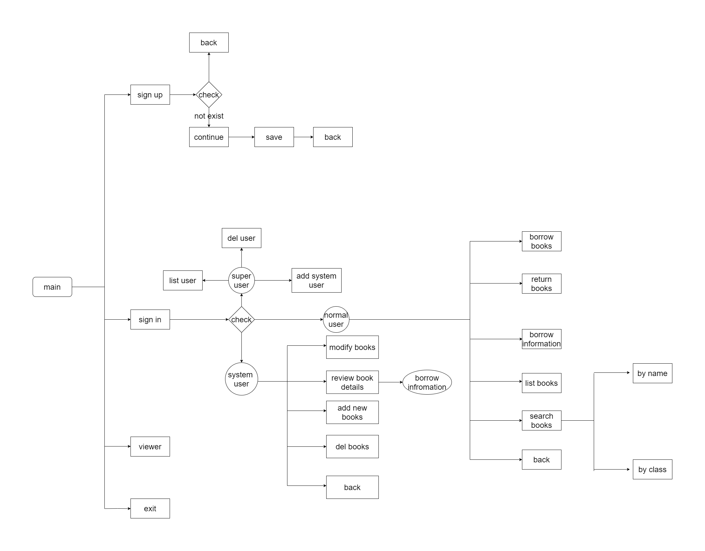

# C-based management system

Collaborative-development-attempt

#### 项目说明：

##### 	该项目是基于c语言的图书管理系统

#### 	项目结构如下：



项目文件结构说明：

```
.
│  .gitignore                         //git push 将会忽略的文件
│  LICENSE                           //版权声明
│  main.c                              //主函数
│  README.md                   
├─doc									//存放了一些关于git和github的说明文档
│  │  git.md
│  │  github.md
│  │  readme.md
│  │
│  └─img
│          library_flow_chart.png
│
├─moudle                           //将要实现的功能模块化放至module目录
│  ├─book                           //存放所有与书籍操作相关的.c .h文件
│  │      handleBook.c 
│  │      handleBook.h
│  │
│  └─user							//存放所有与用户操作相关的.c .h文件，handle*Tools存放二级调用函数
│          handleUser.c
│          handleUser.h
│          handleUserTools.c         
│          handleUserTools.h
│
├─src									//所有用户信息和书籍信息存在src目录下
│      infoUser.txt
│
├─toolkit                              //toolkit目录下存放一些工具函数
│      tool.c
│      tool.h
│
└─view                                  //视图的呈现相关放在view目录下
        menu.c
        menu.h
```


